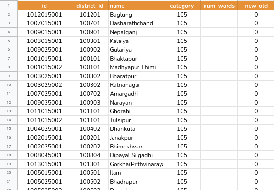

# National-Identification-System
<hr>

<<<<<<< HEAD
### Installing dependencies
First install conda

Then run following commands in given order from project folder(National-Identification-System folder)
```bash
conda create --name DBMS --file NID/envs/requirements.txt
conda deactivate & conda activate DBMS
pip install -r NID/envs/pip_requirements.txt
```

### Running the website
First make all necessary migrations from inside teh `NID` folder
```
python manage.py makemigrations accounts
python manage.py makemigrations documents 
python manage.py makemigrations address 
python manage.py migrate
```

Then from inside `NID` folder
```
python manage.py runserver
```
=======
[Required google sheets file ](https://docs.google.com/spreadsheets/d/1RmVt1pjOToTLgKuQOFXs5KB5VeLlGD7CVkuO1llJD78/edit?usp=sharing)

# Todo:

<hr>

- Complete the `58` missing entries for `num_wards` in [LocalBodies](https://docs.google.com/spreadsheets/d/1RmVt1pjOToTLgKuQOFXs5KB5VeLlGD7CVkuO1llJD78/edit#gid=2067587706) sheet

  

<hr>

# Workflow:
- Database models (models)
  - Citizenship
  - Driving license and voter ID
  - Uploading and storing files in database
- Django model forms from models of documents (views)
- User login register (models + views)
- Document authentication (models + views)
- Frontend 
- Dynamically update address form options - AJAX
    
>>>>>>> 8c5a1cc02a373617ea50b091b5edb8ce7a7b0d15
