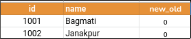
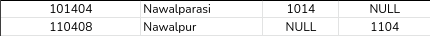

# National-Identification-System
<hr>

[Required google sheets file ](https://docs.google.com/spreadsheets/d/1RmVt1pjOToTLgKuQOFXs5KB5VeLlGD7CVkuO1llJD78/edit?usp=sharing)

# Todo:
- A python script `region.py` that reads in the [Region](https://docs.google.com/spreadsheets/d/1RmVt1pjOToTLgKuQOFXs5KB5VeLlGD7CVkuO1llJD78/edit#gid=535988665) sheet and outputs the following line of code for each row in the table into another file `region_queries.py`
  $~$
    ```python
    Region(id=____, name="_____", new_old=______).save()   
    ```

    E.g.
    For this single entry, 
    

    `region_queries.py`
    ```python{.line-numbers}
    Region(id=1001, name="Bagmati", new_old=0).save()
    Region(id=1002, name="Janakpur", new_old=0).save()
    ```
<hr>

- A python script `district.py` that reads in the [District](https://docs.google.com/spreadsheets/d/1RmVt1pjOToTLgKuQOFXs5KB5VeLlGD7CVkuO1llJD78/edit#gid=371363004) sheet and outputs the following line of code for each row in the table into another file `district_queries.py`
  $~$
    ```python{.line-numbers}
    District(id=____, name="_____", zone=Region.objects.get(id=$zoneID), 
             province=Region.objects.get(id=$provinceID)).save()   
    # insert values in place of $zoneID and $provinceID from sheet
    ```

    E.g.
    For these single entry, 
    

    `district_queries.py`
    ```python{.line-numbers}
    District(id=100801, name="Achham", zone=Region.objects.get(id=1008), 
             province=Region.objects.get(id=1107)).save()
    ```

    - **Handling Null entries:** Skip corresponding parameter in the output code
        
        `district_queries.py`
        ```python{.line-numbers}
        District(id=101404, name="Nawalparasi", zone=Region.objects.get(id=1014)).save()
        District(id=110408, name="Nawalpur", province=Region.objects.(id=1104)).save()
        ```
<hr>

- A python script `localbodycategory.py` that reads in the [LocalBodyTypes](https://docs.google.com/spreadsheets/d/1RmVt1pjOToTLgKuQOFXs5KB5VeLlGD7CVkuO1llJD78/edit#gid=1666503006) sheet and outputs the following line of code for each row in the table into another file `localbodycategory_queries.py`
  $~$
    ```python
    LocalBodyCategory(id=____, name="_____", new_old=______).save()   
    ```

    E.g.
    For these two entries, 
    

    `localbodytypes_queries.py`
    ```python{.line-numbers}
    LocalBodyCategory(id=102, name="Metropolitan City", new_old=1).save()
    ```

<hr>

- Complete the `58` missing entries for `num_wards` in [LocalBodies](https://docs.google.com/spreadsheets/d/1RmVt1pjOToTLgKuQOFXs5KB5VeLlGD7CVkuO1llJD78/edit#gid=2067587706) sheet

  

<hr>

-  A python script `localbody.py` that reads in the [LocalBodies](https://docs.google.com/spreadsheets/d/1RmVt1pjOToTLgKuQOFXs5KB5VeLlGD7CVkuO1llJD78/edit#gid=2067587706) sheet and outputs the following line of code for each row in the table into another file `localbody_queries.py`
  $~$
    ```python{.line-numbers}
    LocalBody(id=______, district=District.objects.get(id=_____), name="_____", 
              category=LocalBodyCategory.objects.get(id=_____), num_wards=____, new_old=____).save()
    ```


    E.g.
    For this single entry, 
    

    `localbody_queries.py`
    ```python{.line-numbers}
    LocalBody(id=1002037001, district=District.objects.get(id=100203), name="Anakar", 
              category=LocalBodyCategory.objects.get(id=107), num_wards=9, new_old=0).save()
    ```

    
    
